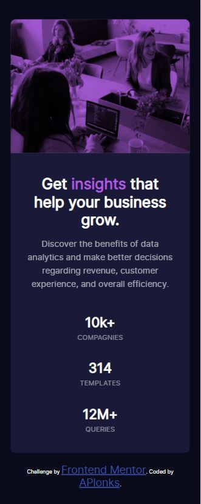

# Frontend Mentor - Stats preview card component solution

This is a solution to the [Stats preview card component challenge on Frontend Mentor](https://www.frontendmentor.io/challenges/stats-preview-card-component-8JqbgoU62). Frontend Mentor challenges help you improve your coding skills by building realistic projects. 

## Table of contents

- [Overview](#overview)
  - [The challenge](#the-challenge)
  - [Screenshot](#screenshot)
  - [Links](#links)
- [My process](#my-process)
  - [Built with](#built-with)
  - [What I learned](#what-i-learned)
  - [Continued development](#continued-development)
  - [Useful resources](#useful-resources)
- [Author](#author)
- [Acknowledgments](#acknowledgments)

**Note: Delete this note and update the table of contents based on what sections you keep.**

## Overview

Here is the challenge "Stats preview card component" from Frontend Mentor.

### The challenge

Users should be able to:

- View the optimal layout depending on their device's screen size

### Screenshot

Desktop design : 
Mobile design : 

### Links

- Solution URL:

### My process

### Built with

- HTML5 
- CSS
- Flexbox
- CSS Grid

### What I learned

Properties about background-image.

### Useful resources

I used espacially  to understand how can i introduce image in background with "good dimensions".

## Author

- APlonks github [Git](https://github.com/APlonks).

## Acknowledgments

Use what you like and what makes the most sense.
